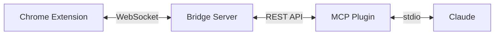

I have a tab problem. Not the "20 tabs" kind, the "80 tabs across 3 windows and I lost that one page I was reading yesterday" kind. So I built a system to fix it: a Chrome extension that manages tabs through lifecycle states, a bridge server that syncs everything, and an MCP plugin that lets Claude manage my tabs through natural language.

The project is called [Tab Lifecycle Manager](https://github.com/ugiordan/tab-manager) and it ships as a monorepo with three packages. Here's how it all fits together.

## The core idea: tab lifecycle states

Instead of tabs just being "open" or "closed," every tab exists in one of four states:

- **Active**: normal open tab, you're using it
- **Snoozed**: tab is closed but remembered, with an optional wake time
- **Queued**: tab is saved for later, ordered by priority
- **Watching**: tab stays open and a CSS selector is monitored for changes

This maps well to how I actually think about tabs. Some I need now, some I want to read later, some I'm waiting on (a CI pipeline, a PR review, a deploy).

## Architecture

The system has three components that communicate in a chain:



The Chrome extension owns all state. It stores everything in Chrome Storage and is the single source of truth. The bridge server is a Node.js Express app that maintains a WebSocket connection to the extension and exposes a REST API. The MCP plugin connects to the bridge's REST API and exposes 9 tools to Claude via the standard MCP protocol.

This layered approach keeps things clean. The extension never talks to Claude directly. The bridge handles protocol translation. The MCP plugin only knows about HTTP endpoints.

## The monorepo setup

```
tab-manager/
  packages/
    extension/    # Chrome extension (React 18, PatternFly 5, Manifest V3)
    bridge/       # Node.js bridge server (Express, WebSocket)
    mcp/          # MCP plugin (@modelcontextprotocol/sdk)
  package.json    # npm workspaces
```

All three packages share TypeScript and Zod schemas for the tab data model. npm workspaces handles dependency management across the monorepo. Each package builds independently but they share types through workspace references.

## MCP tool registration

The MCP plugin registers 9 tools that Claude can call. Here's the pattern I use for each tool:

```typescript
server.tool(
  "tabs_lifecycle",
  "Move tabs between lifecycle states (active, snoozed, queued, watching)",
  {
    tabIds: z.array(z.number()).describe("Tab IDs to transition"),
    targetState: z.enum(["active", "snoozed", "queued", "watching"]),
    options: z.object({
      wakeAt: z.string().optional().describe("ISO timestamp for snooze wake"),
      priority: z.number().optional().describe("Queue priority (1-5)"),
      selector: z.string().optional().describe("CSS selector for watch mode"),
    }).optional(),
  },
  async ({ tabIds, targetState, options }) => {
    const response = await fetch(`${BRIDGE_URL}/api/tabs/lifecycle`, {
      method: "POST",
      headers: { "Content-Type": "application/json" },
      body: JSON.stringify({ tabIds, targetState, options }),
    });
    const result = await response.json();
    return { content: [{ type: "text", text: JSON.stringify(result, null, 2) }] };
  }
);
```

Every tool follows this same shape: name, description, Zod schema for input validation, async handler that calls the bridge REST API. The `@modelcontextprotocol/sdk` handles all the stdio transport and JSON-RPC framing.

The full set of tools:

| Tool | What it does |
|------|-------------|
| `tabs_list` | List tabs with optional state/window filters |
| `tabs_lifecycle` | Move tabs between states |
| `tabs_snooze` | Snooze tabs with a wake time |
| `tabs_queue` | Add tabs to the read queue with priority |
| `tabs_watch` | Monitor a page element via CSS selector |
| `tabs_wake` | Wake snoozed/queued tabs back to active |
| `tabs_meeting` | Bulk snooze all non-pinned tabs, restore after |
| `tabs_stats` | Get tab counts and state breakdown |
| `tabs_suggest` | Get suggestions for tabs to snooze/close |

## WebSocket sync flow

The bridge server maintains a persistent WebSocket connection to the extension. When the MCP plugin makes a REST call, the bridge translates it into a WebSocket message and waits for the extension's response:

```typescript
// Bridge server: REST -> WebSocket translation
app.post("/api/tabs/lifecycle", async (req, res) => {
  const { tabIds, targetState, options } = lifecycleSchema.parse(req.body);

  const requestId = crypto.randomUUID();
  const responsePromise = waitForResponse(requestId, 5000);

  ws.send(JSON.stringify({
    id: requestId,
    type: "lifecycle",
    payload: { tabIds, targetState, options },
  }));

  try {
    const result = await responsePromise;
    res.json(result);
  } catch {
    res.status(504).json({ error: "Extension did not respond in time" });
  }
});
```

The `waitForResponse` function creates a promise that resolves when a message with the matching `requestId` comes back on the WebSocket. There's a 5-second timeout so the bridge never hangs if the extension is unresponsive.

On the extension side, the service worker listens for WebSocket messages, performs the Chrome API calls, and sends the result back:

```typescript
// Extension service worker: WebSocket message handler
ws.onmessage = async (event) => {
  const message = JSON.parse(event.data);
  const { id, type, payload } = message;

  let result;
  switch (type) {
    case "lifecycle":
      result = await transitionTabs(payload.tabIds, payload.targetState, payload.options);
      break;
    case "list":
      result = await listTabs(payload.filters);
      break;
    // ... other message types
  }

  ws.send(JSON.stringify({ id, result }));
};
```

## Meeting mode

This is my favorite feature. When I join a meeting, I tell Claude "meeting mode" and it bulk-snoozes every non-pinned tab. My browser goes from 60 tabs to just the 3-4 pinned ones (email, calendar, chat). When the meeting ends, I say "meeting over" and everything comes back exactly where it was.

Under the hood, `tabs_meeting` with `action: "start"` stores all active tab URLs and positions, then closes them. With `action: "end"`, it reopens everything in the correct windows and positions. Pinned tabs are never touched.

## Watch mode

Watch mode lets me monitor specific elements on a page. I give it a CSS selector, and the extension polls the element's text content for changes. When something changes, it sends a notification.

Practical uses: monitoring a CI pipeline status badge, watching a PR's review count, checking if a deploy page shows "complete." The CSS selector targeting means it works on any page without needing site-specific integrations.

## Security decisions

I did a thorough security review before shipping. Key decisions:

**CORS**: The bridge server only accepts requests from `localhost`. The MCP plugin runs locally, so there's no reason to allow any other origin.

**Input validation**: Every REST endpoint and WebSocket message is validated with Zod schemas. The extension rejects any message that doesn't match the expected shape. This matters because the WebSocket connection is unauthenticated (it's localhost-only, but defense in depth).

**Storage mutex**: Chrome Storage operations aren't atomic. If two operations try to read-modify-write at the same time, you get race conditions. I added a mutex that serializes all storage writes. It's a simple queue, nothing fancy, but it prevents the "tabs disappearing" bug I hit during development.

**No remote execution**: The MCP tools can only perform predefined operations. There's no "execute arbitrary JavaScript" tool. The CSS selectors for watch mode are passed to `document.querySelector`, which is safe (it can't execute code).

## Testing

95 tests across the three packages, all running with Vitest. The extension tests mock the Chrome APIs. The bridge tests spin up a real Express server and WebSocket connection. The MCP tests use the SDK's test utilities to simulate tool calls without needing a real Claude connection.

The tests caught several real bugs. A particularly annoying one: Chrome's `tabs.move` API silently ignores invalid indices instead of throwing, so my "restore tabs to original positions" logic was putting tabs in the wrong order. The fix was to sort tabs by their target index before moving them.

## Tech stack summary

- **Extension**: TypeScript, React 18, PatternFly 5, Chrome Manifest V3
- **Bridge**: TypeScript, Express, ws (WebSocket), Zod
- **MCP**: TypeScript, @modelcontextprotocol/sdk, Zod
- **Build**: npm workspaces, Vite (extension), tsc (bridge/mcp)
- **Testing**: Vitest (95 tests across all packages)

## What I learned

Building the MCP plugin was the easy part. The `@modelcontextprotocol/sdk` makes tool registration straightforward, and the stdio transport just works. The hard part was the Chrome extension side: service worker lifecycle, storage race conditions, and the WebSocket reconnection logic.

The layered architecture (extension, bridge, MCP) adds complexity, but it's worth it. Each layer has a single responsibility, and I can test them independently. The bridge could also serve other clients in the future (a CLI, a web dashboard, another AI integration).

If you're building MCP tools that interact with browser state, I'd recommend this pattern. Don't try to cram everything into the extension or the MCP server. Use a bridge to decouple them.

Docs are at [ugiordan.github.io/tab-manager](https://ugiordan.github.io/tab-manager/) and the source is on [GitHub](https://github.com/ugiordan/tab-manager).
